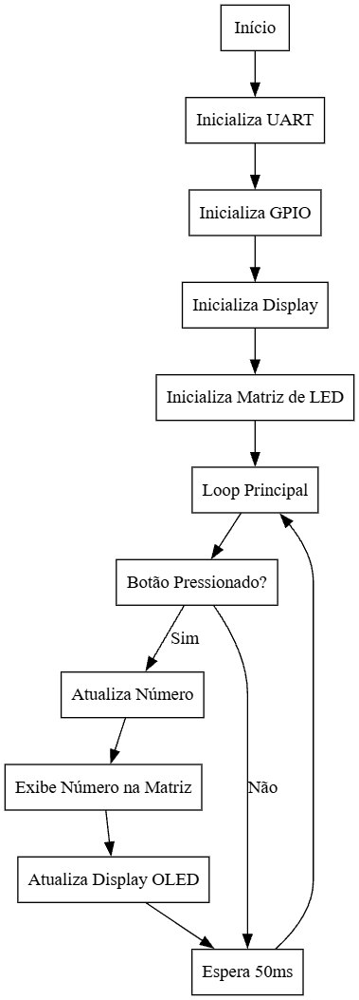
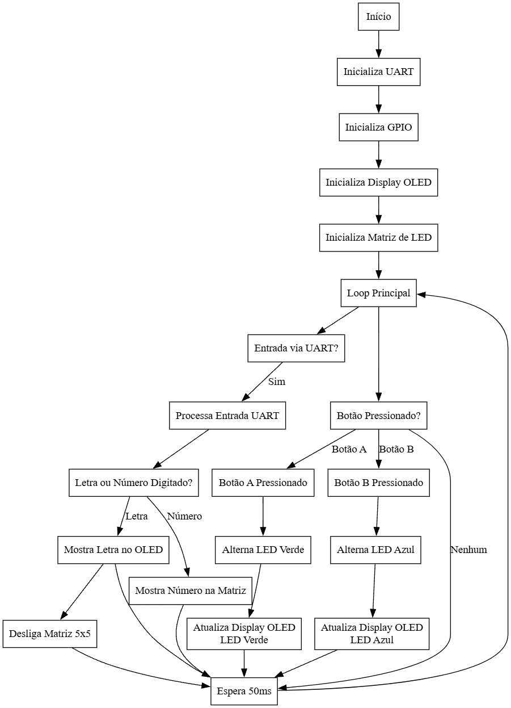

# BitDogLab_UART_I2C_Explorer

Projeto para explorar a comunicação UART e I2C com o RP2040 na placa BitDogLab.

Inclui controle de LEDs RGB, matriz WS2812, botões com interrupções e debounce, além da exibição de caracteres no display SSD1306.

## Funcionalidades

* Comunicação UART com entrada de caracteres via Serial Monitor.
* Exibição de caracteres no display SSD1306 via I2C.
* Controle de LEDs RGB com botões físicos e interrupções.
* Suporte a LEDs WS2812 para exibição de números em matriz 5x5.
* Capacidade de desligamento automático da matriz após inatividade.
* Comandos UART para limpar a tela e desligar o sistema.

## Bibliotecas Utilizadas

### **1. Pico SDK**

O **Pico SDK** fornece a base para a programação no RP2040, incluindo suporte para  **GPIO, UART, I2C e PIO** . É essencial para comunicação com periféricos e controle de hardware da placa.

### **2. hardware/i2c.h**

Utilizada para comunicação via **I2C** com o display SSD1306. Permite a troca de dados entre o microcontrolador e dispositivos I2C externos, como sensores e displays.

### **3. hardware/irq.h**

Gerencia  **interrupções de hardware** , usadas para detectar eventos como o pressionamento de botões e realizar ações imediatas sem bloquear o código principal.

### **4. hardware/uart.h**

Utilizada para comunicação **UART** entre o RP2040 e o terminal serial, permitindo envio e recepção de dados.

### **5. led_matrix.h**

Biblioteca personalizada para controle da  **matriz de LEDs WS2812** . Permite a exibição de números na matriz com controle individual de cada LED RGB.

### **6. ssd1306.h**

Biblioteca para manipular o **display OLED SSD1306** via  **I2C** . Permite exibir caracteres e gráficos básicos no display.

### **7. font.h**

Define fontes de caracteres usadas no display SSD1306.

## Estrutura do Projeto

```plaintext
BitDogLab_UART_I2C_Explorer  # Nome do programa principal
├── inc/                     # Diretório de cabeçalhos
│   ├── font.h               # Fontes de caracteres para o display
│   ├── ssd1306.h            # Biblioteca do display OLED
├── led_matrix.h             # Cabeçalho da matriz de LED
├── led_matrix.c             # Implementação da matriz de LED
├── pio_config.h             # Configuração do PIO para WS2812
├── ws2812b.pio.h            # Código PIO para LEDs WS2812
├── BitDogLab_UART_I2C_Explorer.c  # Código-fonte principal
├── pico_sdk_import.cmake    # Configuração do SDK
├── CMakeLists.txt           # Configuração do projeto
├── wokwi.toml               # Configuração para simulação no Wokwi
├── diagram.json             # Fluxograma do projeto
├── README.md                # Introdução e documentação do projeto
```

## Dificuldades Encontradas

Durante o desenvolvimento, alguns desafios surgiram e foram superados:

1. **Comunicação UART** : Inicialmente, os caracteres recebidos via UART não eram processados corretamente. A solução foi utilizar `stdio_usb_connected()` e `scanf()` para garantir a leitura correta.
2. **Matriz 5x5 WS2812** : Ajustar o mapeamento correto dos LEDs foi desafiador, exigindo testes e cálculos para garantir a correta exibição de números.
3. **Interrupções nos botões** : O debounce foi refinado para evitar acionamentos múltiplos ao pressionar os botões físicos.
4. **Display SSD1306** : Algumas mensagens não apareciam corretamente, e foi necessário ajustar o tamanho do buffer e as funções de escrita no display.

## Comandos Especiais via UART

O sistema aceita alguns comandos especiais enviados pelo terminal UART:

* **Digitar um número (`0-9`)** : Exibe o número na matriz 5x5 de LEDs WS2812.
* **Digitar uma letra (`A-Z` ou `a-z`)** : Exibe a letra no display OLED e desliga a matriz de LEDs.

## Configuração

1. Clone o repositório:
   ```bash
   git clone https://github.com/hsantosdias/BitDogLab_UART_I2C_Explorer.git
   ```
2. Compile e envie para o RP2040 utilizando o VS Code + Pico SDK.

## Fluxograma

O fluxograma abaixo representa o funcionamento do código principal:

**Fluxograma simplificado do projeto**


[](https://github.com/hsantosdias/BitDogLab_UART_I2C_Explorer/blob/main/imgs/fluxograma-simplificado.png?raw=true "Fluxograma Simplificado")

*Este fluxograma mostra a estrutura básica do código principal, incluindo inicializações e o loop principal de execução.*

**Fluxograma completo do projeto**

[](https://github.com/hsantosdias/BitDogLab_UART_I2C_Explorer/blob/main/imgs/fluxograma-completo.png?raw=true "Flugrama de interações entre as funções")

### **Descrição Simplificada do Fluxograma**

O fluxograma representa o funcionamento do sistema, desde a inicialização até a interação com os componentes.

1. **Inicialização**
   * O sistema é ligado e inicializa  **UART** ,  **GPIOs** , **Display OLED** e  **Matriz de LED 5x5** .
   * Após a inicialização, entra no  **loop principal** .
2. **Entrada via UART (Teclado do PC)**
   * Se houver entrada via  **UART** , o sistema processa o caractere digitado.
   * Se for uma  **letra** , ela é exibida no **OLED** e a  **matriz de LED é desligada** .
   * Se for um  **número (0-9)** , ele é exibido na  **matriz de LED** .
3. **Interação com os Botões**
   * Se um botão for pressionado:
     * **Botão A:** Alterna o estado do **LED Verde** e exibe a mudança no  **OLED** .
     * **Botão B:** Alterna o estado do **LED Azul** e exibe a mudança no  **OLED** .
   * Se nenhum botão for pressionado, o sistema continua aguardando.
4. **Ciclo Contínuo**
   * Após processar  **UART ou Botões** , o sistema espera **50ms** antes de continuar o loop.

**Resumo:** O sistema lê entradas do teclado (UART) e exibe caracteres no OLED e números na matriz 5x5. Ele também responde aos botões alternando LEDs e exibindo o status no display.
